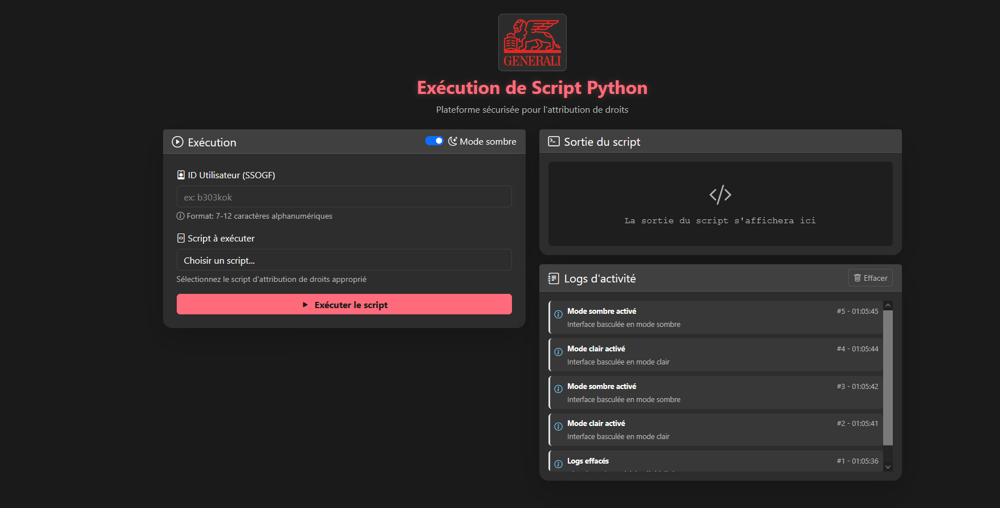

# Go Form App

Une application web sécurisée en Go permettant l'exécution contrôlée de scripts Python, Bash et Zsh via une interface web moderne et intuitive.



## Fonctionnalités

### Interface Utilisateur
- **Interface web moderne et responsive** avec thème sombre/clair
- **Design Generali** avec logo et couleurs corporatives
- **Interface temps réel** avec logs d'activité en direct
- **Validation instantanée** des entrées utilisateur
- **Feedback visuel** pour toutes les opérations

### Sécurité & Exécution
- **Exécution sécurisée** de scripts Python, Bash et Zsh
- **Validation stricte** des entrées utilisateur (format SSOGF)
- **Protection CSRF** avec tokens sécurisés
- **Isolation complète** des environnements d'exécution
- **Logs de sécurité** détaillés et monitoring en temps réel
- **Rate limiting** et protection DoS

### Infrastructure
- **Support Docker** complet avec multi-stage builds
- **Reverse proxy Nginx** pour la production
- **Health checks** automatiques
- **Tests unitaires** avec couverture élevée

## Architecture

```
go-form-app/
├── cmd/server/http/          # Serveur HTTP et handlers
│   └── web/                 # Interface web (templates, CSS, assets)
├── internal/
│   ├── scripts/             # Moteur d'exécution sécurisé
│   │   ├── python/         # Scripts Python autorisés
│   │   ├── bash/           # Scripts Bash autorisés
│   │   └── zsh/            # Scripts Zsh autorisés
│   └── utils/               # Utilitaires (gestion des ports)
├── docker/                  # Configuration Docker & Nginx
├── docs/                    # Documentation et captures d'écran
├── Makefile                # Commandes de développement
└── main.go                 # Point d'entrée de l'application
```

## 📸 Interface Utilisateur

L'application propose une interface web moderne avec :

### Mode Clair/Sombre
- **Thème adaptatif** : Mode clair par défaut, mode sombre disponible
- **Design Generali** : Respect de l'identité visuelle corporate
- **Interface responsive** : Optimisée pour desktop et mobile

### Fonctionnalités UI
- **Sélection de scripts** : Menu déroulant avec descriptions
- **Validation temps réel** : Vérification instantanée des entrées
- **Logs d'activité** : Historique en temps réel des actions
- **Sortie de script** : Affichage formaté des résultats d'exécution
- **Indicateurs visuels** : Status, progress, feedback utilisateur

## 🚀 Installation et Démarrage

### Prérequis

- **Go 1.21+** : Langage de programmation principal
- **Docker & Docker Compose** : Pour le déploiement containerisé
- **Python 3.x, Bash, Zsh** : Interpréteurs pour l'exécution des scripts

### Développement Local

```bash
# Cloner le projet
git clone <repository-url>
cd go-form-app

# Installer les dépendances
go mod download

# Lancer l'application
go run main.go

# Ou utiliser le Makefile
make dev
```

L'application sera accessible sur **http://localhost:8001**
> 📝 Si le port 8001 est occupé, l'application trouve automatiquement un port libre (8001-8015)

### Déploiement Docker

```bash
# Mode développement
cd docker
docker-compose up --build

# Mode production avec Nginx
docker-compose --profile production up -d --build

# Ou utiliser le Makefile
make docker-run          # Mode développement
make docker-prod         # Mode production
```

**Accès :**
- **Développement** : http://localhost:8001
- **Production** : http://localhost (port 80 via Nginx) + http://localhost:8001 (direct)

## Configuration

### Variables d'environnement

| Variable | Description | Défaut | Exemple |
|----------|-------------|--------|---------|
| `PORT` | Port d'écoute | `8001` | `8080` |
| `GO_ENV` | Environnement | `development` | `production` |

### Scripts autorisés

La sécurité repose sur une **whitelist stricte** des scripts autorisés :

| Script | Type | Description |
|--------|------|-------------|
| `script1.py` | Python | Attribution des droits de base |
| `script2.py` | Python | Configuration d'accès avancé |
| `script1.sh` | Bash | Attribution des droits avec validation |
| `script1.zsh` | Zsh | Configuration avancée avec vérifications |

> **Sécurité** : Seuls les scripts de cette liste peuvent être exécutés

## Sécurité

### Mesures de protection implémentées

| Couche | Mesures | Description |
|--------|---------|-------------|
| **Validation** | Format UserID strict | Pattern `^[a-zA-Z0-9]{7,12}$` (SSOGF) |
| **Scripts** | Whitelist stricte | Seuls les scripts autorisés peuvent s'exécuter |
| **Web** | Protection CSRF | Tokens sécurisés pour toutes les requêtes POST |
| **Exécution** | Isolation complète | Environnement limité, timeouts, utilisateur non-root |
| **Injection** | Filtrage patterns | Détection et blocage des commandes dangereuses |
| **Headers** | Sécurité HTTP | X-Frame-Options, CSP, X-XSS-Protection |
| **DoS** | Rate limiting | Protection contre les attaques par volume |
| **Path** | Anti-traversal | Blocage des tentatives d'accès système |

### Format UserID (SSOGF)

```regex
^[a-zA-Z0-9]{7,12}$
```

- **Longueur** : 7 à 12 caractères
- **Caractères** : Alphanumériques uniquement (a-z, A-Z, 0-9)
- **Exemples valides** : `b303kok`, `user123`, `ADMIN789`
- **Exemples invalides** : `ab@123`, `user_123`, `toolong1234567`

## Tests

### Exécution des tests

```bash
# Tests rapides
make test                    # Tests unitaires
make test-verbose           # Tests avec sortie détaillée
make test-race             # Tests avec détection de race conditions

# Couverture
make test-coverage         # Génère coverage.html
make bench                 # Benchmarks de performance

# Tests Docker
make docker-test          # Tests dans conteneur
```

### Couverture de tests

| Package | Coverage | Status | Tests |
|---------|----------|--------|-------|
| `internal/utils` | **89.5%** ✅ | Excellent | Port management, validation |
| `internal/scripts` | **67.0%** ✅ | Très bon | Sécurité, exécution, isolation |
| `cmd/server/http` | **58.8%** ⚠️ | Correct | Handlers, middleware, CSRF |
| **Global** | **62.5%** ✅ | Bon | 50+ tests unitaires |

> 📊 Voir le [rapport détaillé](test_coverage.md) pour plus d'informations

## Développement

### Makefile

Le projet inclut un **Makefile complet** avec toutes les commandes nécessaires :

```bash
# Aide et information
make help              # Liste des commandes disponibles

# Développement
make build             # Compiler l'application
make dev               # Lancer en mode développement
make watch             # Rechargement automatique (nécessite entr)
make fmt               # Formatter le code Go
make lint              # Linter avec golangci-lint

# Tests
make test              # Tests unitaires
make test-verbose      # Tests avec sortie détaillée
make test-coverage     # Rapport de couverture HTML
make test-race         # Détection de race conditions
make bench             # Benchmarks de performance

# Docker
make docker-build      # Build de l'image Docker
make docker-run        # Lancer avec Docker Compose
make docker-prod       # Mode production avec Nginx
make docker-stop       # Arrêter les conteneurs
make docker-clean      # Nettoyer les conteneurs et images

# Outils
make install-tools     # Installer les outils de développement
make clean             # Nettoyer les artefacts
make quick-test        # Format + tests rapides
```

### Structure du code

| Composant | Description | Responsabilité |
|-----------|-------------|---------------|
| `main.go` | Point d'entrée | Initialisation, gestion des ports |
| `cmd/server/http/` | Serveur web | Handlers, middleware, sécurité HTTP |
| `cmd/server/http/web/` | Interface utilisateur | Templates, CSS, assets statiques |
| `internal/scripts/` | Moteur d'exécution | Isolation, validation, exécution sécurisée |
| `internal/utils/` | Utilitaires | Gestion des ports, helpers |
| `docker/` | Conteneurisation | Dockerfile, Compose, Nginx |

### Standards de qualité

- ✅ **Code propre** : Commentaires utiles uniquement, noms explicites
- ✅ **Conventions Go** : Format gofmt, documentation des exports
- ✅ **Conventions PEP8** : Scripts Python documentés avec Args/Returns
- ✅ **Sécurité** : Validation stricte, isolation, logging détaillé
- ✅ **Tests** : Couverture > 60%, tests unitaires et d'intégration

## API

### Endpoints

| Méthode | Endpoint | Description | Authentification |
|---------|----------|-------------|------------------|
| `GET` | `/` | Interface web principale | Aucune |
| `POST` | `/run-script` | Exécution de script | **CSRF Token requis** |
| `GET` | `/static/*` | Assets statiques (CSS, JS, images) | Aucune |
| `GET` | `/health` | Health check (via Nginx) | Aucune |

### Format de requête

```http
POST /run-script HTTP/1.1
Content-Type: application/x-www-form-urlencoded
X-CSRF-Token: <csrf-token>

userId=b303kok&script=script1.py&csrf_token=<token>
```

### Réponse JSON

```json
{
  "status": "success",
  "message": "Script exécuté avec succès",
  "success": true,
  "output": "SUCCESS: Droits attribués à l'utilisateur b303kok",
  "duration": "1.234s"
}
```

**En cas d'erreur :**
```json
{
  "status": "error",
  "message": "Format d'ID utilisateur invalide",
  "success": false
}
```

## Logs et Monitoring

### Types de logs

| Type | Niveau | Description | Exemple |
|------|--------|-------------|---------|
| **EXECUTION** | `INFO` | Exécution des scripts | Démarrage, fin, durée |
| **SECURITY_EVENT** | `WARN` | Événements sécurisés | Tentatives d'intrusion, validations |
| **DEBUG** | `DEBUG` | Débogage détaillé | Validation des entrées |

### Logs en temps réel

L'interface web affiche les logs d'activité en temps réel :
- **Actions utilisateur** (sélection script, changement thème)
- **Validations** (succès/échec des entrées)
- **Exécutions** (démarrage, progression, résultats)
- **Erreurs** (échecs, timeouts, sécurité)

### Exemple de logs serveur

```log
[HTTP-SERVER] 2025/01/01 12:00:00 SECURITY_EVENT: script_execution_request | IP: 192.168.1.1 | UserAgent: Mozilla/5.0 | Details: user:b303kok script:script1.py
[HTTP-SERVER] 2025/01/01 12:00:01 EXECUTION: Starting python script script1.py for user b303kok
[HTTP-SERVER] 2025/01/01 12:00:02 EXECUTION: Script script1.py completed successfully for user b303kok (duration: 1.234s)
```

## Monitoring et Observabilité

### Health Checks

| Paramètre | Valeur | Description |
|-----------|--------|-------------|
| **Endpoint** | `GET /` | Point de contrôle principal |
| **Intervalle** | 30 secondes | Fréquence de vérification |
| **Timeout** | 10 secondes | Délai d'attente maximum |
| **Retries** | 3 tentatives | Nombre d'essais avant échec |

### Métriques collectées

- **Performance** : Temps d'exécution des scripts, latence HTTP
- **Succès/Échec** : Taux de réussite des exécutions
- **Sécurité** : Tentatives d'intrusion, validations échouées
- **Usage** : Nombre de requêtes, scripts populaires
- **Système** : Utilisation CPU/mémoire (Docker)

### Tableau de bord

L'interface web fournit un monitoring en temps réel :
- **Logs d'activité** avec historique des 50 dernières actions
- **Status des exécutions** avec feedback instantané
- **Métriques de performance** (durée d'exécution)
- **Alertes visuelles** pour les erreurs et succès

## 🤝 Contribution

### Standards de qualité

| Critère | Exigence | Vérification |
|---------|----------|--------------|
| **Tests** | Obligatoires pour nouvelles features | `make test` |
| **Couverture** | Minimum 60% par package | `make test-coverage` |
| **Linting** | Code propre sans warnings | `make lint` |
| **Format** | Standard Go/PEP8 | `make fmt` |
| **Documentation** | Fonctions publiques documentées | Review manuelle |

### Process de contribution

1. **Fork** le projet
2. **Créer** une branche feature (`git checkout -b feature/nouvelle-feature`)
3. **Ajouter** des tests appropriés
4. **Vérifier** la couverture (`make test-coverage`)
5. **Formatter** le code (`make fmt && make lint`)
6. **Documenter** les changements
7. **Soumettre** une Pull Request

### Avant de soumettre

```bash
make quick-test          # Tests rapides + format
make test-coverage       # Vérifier la couverture
make docker-test         # Tests en environnement Docker
```

## Licence

Ce projet est sous licence **[À spécifier]**. Voir le fichier `LICENSE` pour plus de détails.

## Support

### Résolution de problèmes

1. **Logs** : Vérifier les logs de l'application
   ```bash
   # Local
   go run main.go
   
   # Docker
   docker-compose logs -f go-form-app
   ```

2. **Documentation** : Consulter [docker/README.md](docker/README.md)

3. **Issues** : Ouvrir une issue avec :
   - Description détaillée du problème
   - Logs pertinents
   - Configuration système
   - Étapes de reproduction

### Ressources utiles

- **Documentation Docker** : [docker/README.md](docker/README.md)
- **Rapport de tests** : [test_coverage.md](test_coverage.md)
- **Makefile** : `make help` pour toutes les commandes